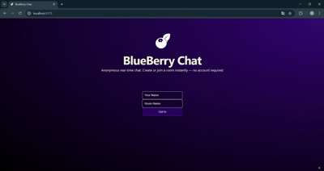

# Chat
My project consists of a practical, chat system that requires no account creation or login. To access it, users simply need to enter with a nickname and the name of the room they wish to join. If the specified room doesn't exist, it's created automatically, if it already exists, the system retrieves the message history from previous participants. The goal is to provide a simple, fast, and accessible communication platform while preserving the participants' partial anonymity.

Chat Project to improve my code skills and my stack, where i document all my evolution and project's progress
### Infrastructure

All infrastructure is currently hosted on **free-tier services** (which is so slow 😭):

| Service | Provider |
|---|---|
| Frontend & Backend | [Render](https://render.com/) |
| Redis | [Upstash](https://upstash.com/) |
| Database | [Supabase](https://supabase.com/) |

# INDEX PAGE
<p align="center">
  
</p>

# CHAT PAGE
<p align="center">
  
</p>

# STACK
- Django Rest Framework
- Django Channels
- Websocket
- React
- SQLite
- Docker
- Redis
- PostgreSQL 
- Celery (soon)
- TDD 
# Installation

## 1. Create a virtual environment

```bash
python -m venv venv
```

## 2. Activate the virtual environment

**Windows**

```bash
venv\Scripts\activate
```

## 3. Install dependencies

**Backend**

```bash
pip install -r requirements.txt
```

**Frontend**

```bash
cd frontend
npm install
```

## 4. Start the application

Start the Django server:

```bash
cd backend
python manage.py runserver
```

Open a new terminal and start the React application:

```bash
cd frontend
npm run dev
```

---

# Redis Setup (Windows + Docker)

This project uses **Redis** with **Django Channels** for real-time communication

## Prerequisites

- Docker Desktop (WSL2 enabled)

## 1. Pull the Redis image

```bash
docker pull redis
```

## 2. Run the Redis container

```bash
docker run --name redis-chat -p 6379:6379 -d redis
```

## 3. Check if the container is running

```bash
docker ps
```

## 4. Start the container (if it was stopped)

```bash
docker start redis-chat
```

## 5. Stop the container

```bash
docker stop redis-chat
```

> **Note:** Make sure Docker Desktop is running before starting the Django server.

---

# Optional Tools

- **SQLite Viewer** (VS Code extension)
- **WebSocket Tester:** https://hoppscotch.io/realtime/websocket
